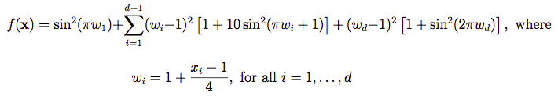
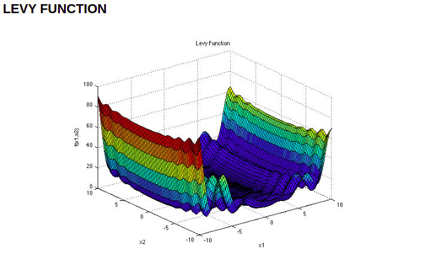

# Trabalho de Inteligência Artificial 2020/1

## Otimizar função BenchMark

### Função 

A função usada é de uma biblioteca de funções, que se encontra no seguinte link: http://www.sfu.ca/~ssurjano/optimization.html
 
A função que será usada é a Levy Function, encontrada no link: http://www.sfu.ca/~ssurjano/levy.html 

A função usada: 



No qual possui o seguinte gráfico:
 


### Como executar

Para executar o algoritmo, precisamos primeiro instalar as dependências. A única dependência para esse programa é o `numpy`. Então, basta instalá-lo com o `pip` assim:

```
pip install numpy
```

Para executar em si o algoritmo, entramos no diretório raiz e damos o seguinte comando: 

```
python3 main.py
```

### Ambiente:

Ambiente usado para desenvolver foi a IDE Pycharm Community Edition
